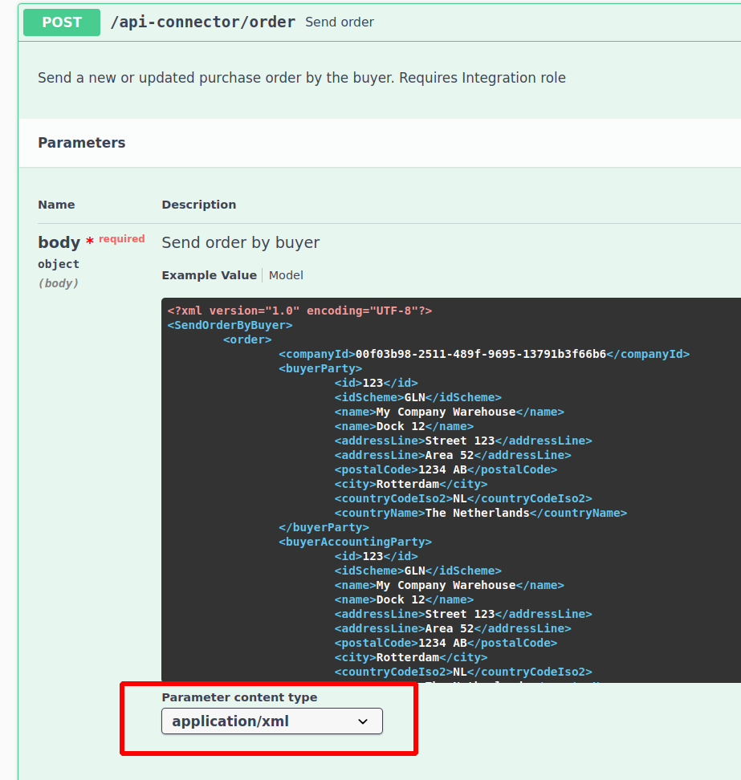
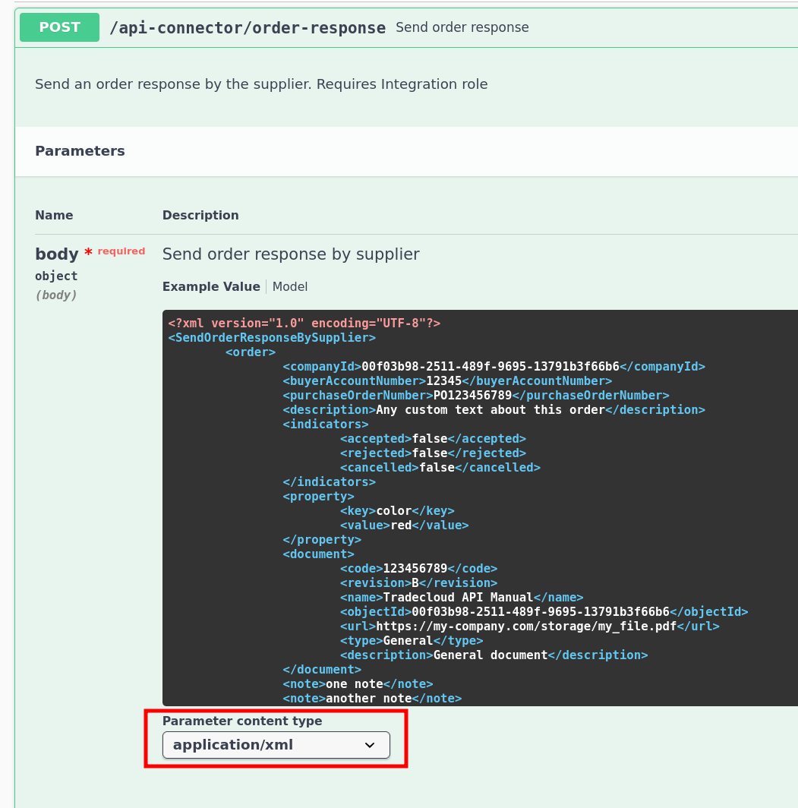
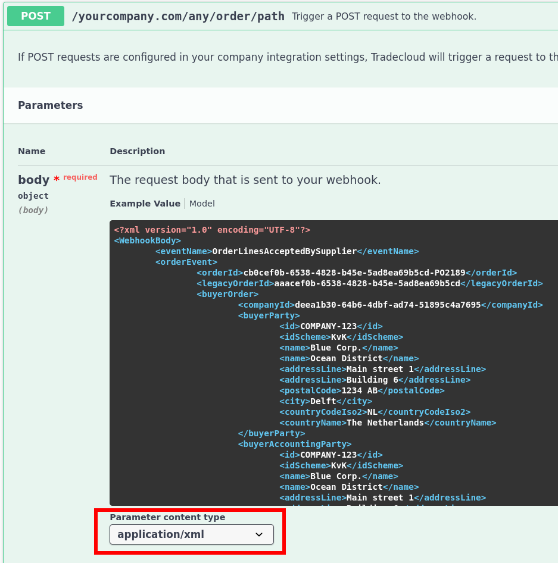

# JSON versus XML

The Tradecloud API supports both JSON and XML formats to accommodate different integration requirements and legacy systems. This guide helps you understand the differences and choose the appropriate format for your implementation.

## Overview

The Tradecloud API provides two data formats:

- **JSON**: The default format for all API endpoints
- **tXML**: A proprietary XML format available for specific endpoints

Both formats contain identical data structures and functionality - tXML is a one-to-one mapping of the JSON format.

## When to use each format

### Use JSON when

- Building new modern integrations (recommended)
- Implementing REST API clients
- You need smaller payload sizes

### Use tXML when

- Integrating with legacy systems that require XML
- Working with enterprise middleware that requires XML
- Your existing infrastructure is XML-based

## JSON Format

JSON is the **default and recommended format** for all Tradecloud API endpoints.

### Advantages

- Smaller payload size & faster parsing
- Better human readability
- Widely supported across programming languages

### Implementation

All API endpoints support JSON by default. Simply use `Content-Type: application/json` in your HTTP headers.

For detailed JSON structure and examples, see the [JSON body format documentation](requests.md#json-body).

## tXML Format

tXML (Tradecloud XML) is a proprietary XML format that provides the same functionality as JSON but in XML structure.

### Supported Endpoints

The following API endpoints support tXML format:

#### Buyer Endpoints

- [Send order](https://swagger-ui.accp.tradecloud1.com/?url=https://api.accp.tradecloud1.com/v2/api-connector/specs.yaml#/buyer-endpoints/sendOrderByBuyerRoute)
- [Send single delivery order](https://swagger-ui.accp.tradecloud1.com/?url=https://api.accp.tradecloud1.com/v2/api-connector/specs.yaml#/buyer-endpoints/sendSingleDeliveryOrderByBuyerRoute)

#### Supplier Endpoints

- [Send order response](https://swagger-ui.accp.tradecloud1.com/?url=https://api.accp.tradecloud1.com/v2/api-connector/specs.yaml#/supplier-endpoints/sendOrderResponseBySupplierRoute)

#### Webhook Endpoints

- [Order Webhook](https://swagger-ui.accp.tradecloud1.com/?url=https://api.accp.tradecloud1.com/v2/order-webhook-connector/specs.yaml#/order-webhook%20endpoints/webhookPost)

### Implementation

To use tXML format, set the `Content-Type` header to `application/xml` in your HTTP requests.

### Viewing tXML Examples

You can view tXML examples in the Swagger UI documentation:

1. Navigate to the desired endpoint in the API documentation
2. In the "Parameter content type" dropdown, select "application/xml"
3. The "Example Value" section will show the tXML structure

#### API Endpoints

- [Send order](https://swagger-ui.accp.tradecloud1.com/?url=https://api.accp.tradecloud1.com/v2/api-connector/specs.yaml#/buyer-endpoints/sendOrderByBuyerRoute)
- [Send single delivery order](https://swagger-ui.accp.tradecloud1.com/?url=https://api.accp.tradecloud1.com/v2/api-connector/specs.yaml#/buyer-endpoints/sendSingleDeliveryOrderByBuyerRoute)

[Send order response](https://swagger-ui.accp.tradecloud1.com/?url=https://api.accp.tradecloud1.com/v2/api-connector/specs.yaml#/supplier-endpoints/sendOrderResponseBySupplierRoute)

#### Webhook Endpoints

[Order Webhook](https://swagger-ui.accp.tradecloud1.com/?url=https://api.accp.tradecloud1.com/v2/order-webhook-connector/specs.yaml#/order-webhook%20endpoints/webhookPost)

For detailed tXML structure and examples, see the [XML body format documentation](requests.md#xml-body).

## Format Compatibility

Both JSON and tXML formats:

- Contain identical data structures
- Support the same business logic
- Provide the same validation rules
- Return equivalent responses

You can switch between formats without losing functionality, making it easy to migrate from one format to another as your integration requirements evolve.

## Getting Additional tXML Support

If you need tXML support for additional API endpoints not currently listed, please contact [Tradecloud support](../support.md) with your specific requirements.

## Next Steps

- Review the [API request formats](requests.md) for detailed implementation examples
- Explore the [Swagger UI documentation](tools/swagger-ui.md) for interactive API testing
- Check the [Postman collection](tools/postman.md) for ready-to-use API examples
