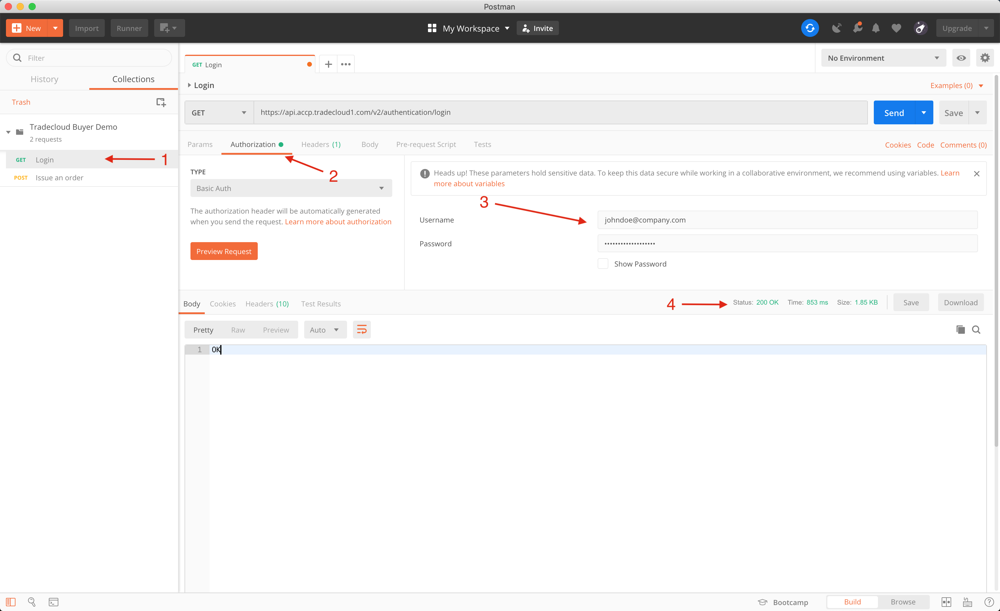
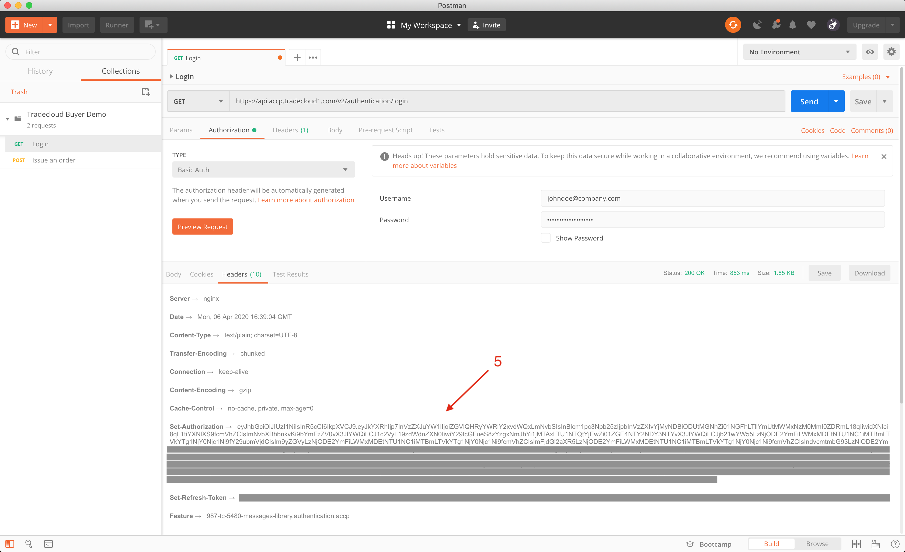
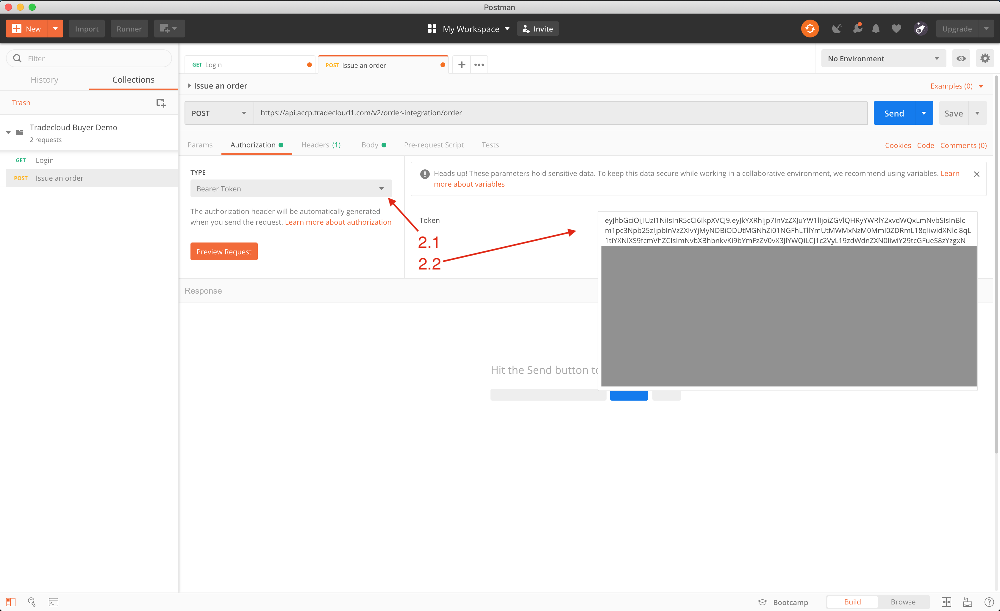
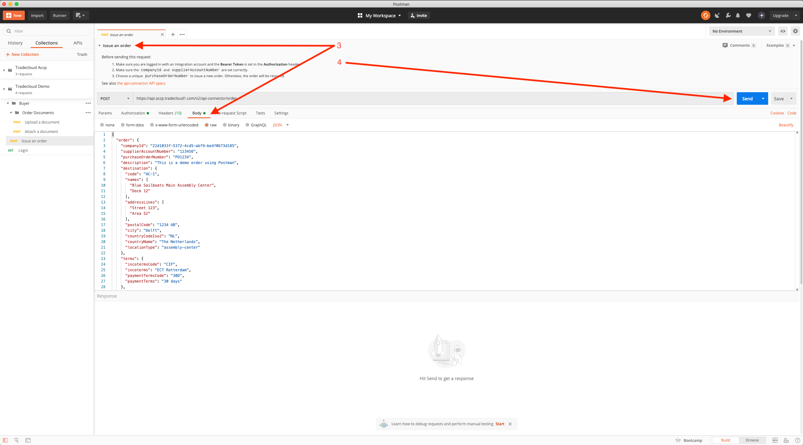

# Postman

This page will illustrate how to use the [Postman API Client](https://www.postman.com/product/api-client) to explore and test the Tradecloud API.

For more information about how to use Postman in general, see the [Postman documentation](https://learning.postman.com/docs/postman/launching-postman/introduction/).

## Importing the Tradecloud Postman Collection

To make things easier, Tradecloud provides a Postman collection with some example requests. You can use this as follows:

1. Download the Tradecloud Postman Collection [using this link](/.gitbook/assets/Tradecloud-Buyer-Demo.postman_collection.json)

2. In Postman, click "Import" and select the file collection you just downloaded.  

You now have a "Tradecloud Buyer Demo" collection in your Postman application. You can change and experiment as much as you want; any changes that are made to this collection are only stored on your computer and not shared with Tradecloud or anyone else. 

Follow the instructions below to start sending your first request to the Tradecloud API.

## Getting a token using Postman

At the start of each session, you first need to login to obtain an authorization token. You'll need this token to authorize yourself for all subsequent requests. The token will expire automatically after 1 hour.

To login and obtain a token:

1. Open the "Login" request in the "Tradecloud Buyer Demo" collection.

2. Go to the "Authorization" tab of the request. 

3. Fill out the **Username** and **Password** fields with your Tradecloud credentials.  
If you don't have any credentials yet, please ask your contact at Tradecloud to set up an account for you.

4. Click "Send". If your login is successful, the API should return a `200 - OK` response.  
  

5. The last step in obtaining your token is now to switch to the "Headers" tab of the _response_ and copy the value of of the **Set-Authentication** header. This is the token you need to use as authorization for all following requests.  
  

## Sending API requests using Postman

With Postman you can easily send a request to the API once you've obtained your [Authorization Token](#getting-a-token-using-postman):

1. Open one of the requests in the "Tradecloud Buyer Demo" collection.

2. In the **Authorization** tab:

    1. Set the Type to **Bearer Token**.
    
    2. Paste your Authorization Token in the **Token** field.  
    

3. Check the body of your request and change the request data where needed.

4. Send!

Want to perform a different API operation? You can easily add new requests to the collection.
Always make sure that you check the **method**, **Request URL**, **Authorization** and **body** of a request against [our OpenAPI Specs](https://api.accp.tradecloud1.com/).


Did you know that you can also send requests to our API right from the Swagger UI? Check out our [Swagger UI documentation](swagger-ui.md)


