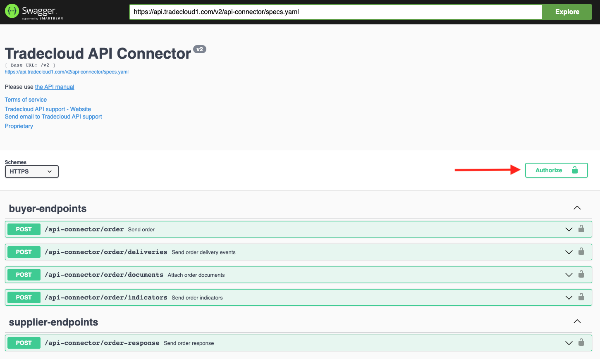
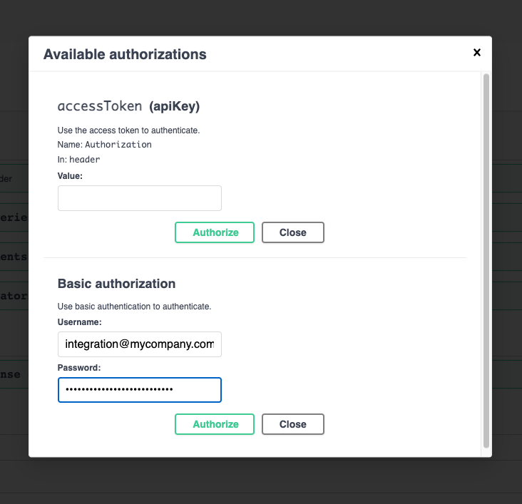
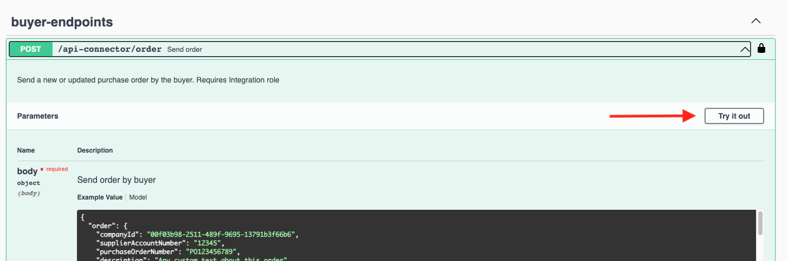
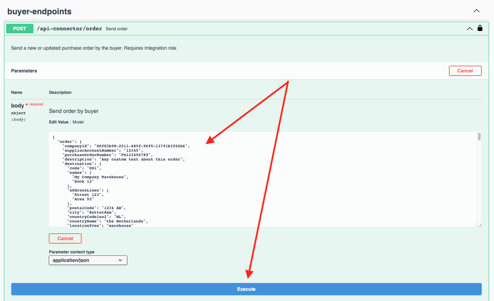

# Swagger UI

You can use the [Swagger UI](https://swagger.io/tools/swagger-ui/) to explore and test the Tradecloud API.

Please refer to the API Environments page for an overview of the available Swagger UI documentation.



## Send an order using the Swagger UI

1. Click the **Authorize** button on the top right  

   

2. Fill in your Basic authorization credentials of the integration user that was provided to you. Click **Authorize** and then **Close**.  

   

3. Click the endpoint you want to use and click on **Try it out**.

   

4. Adjust the request body according to the data you want to send to Tradecloud.

   

5. Click the **Execute** button.  

   The **Responses** section in the Swagger UI should display the API response and the effects of your request should now be visible in the Tradecloud Portal.

