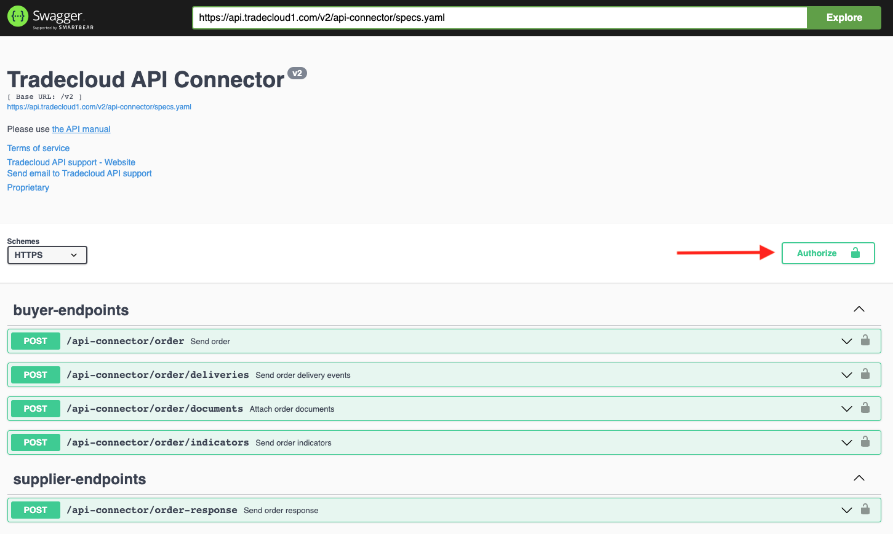
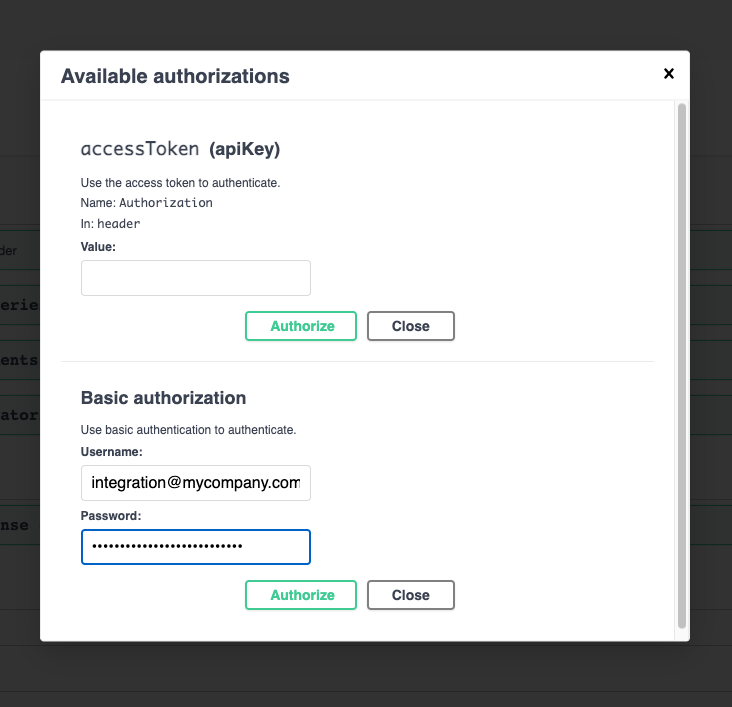

# Swagger UI

You can use the [Swagger UI](https://swagger.io/tools/swagger-ui/) to explore and test the Tradecloud API:

| Service | Acceptance | Production |
|---|---|---|
| api-connector | [YAML](https://api.accp.tradecloud1.com/v2/api-connector/specs.yaml) / [Swagger UI](https://swagger-ui.accp.tradecloud1.com/?url=https://api.accp.tradecloud1.com/v2/api-connector/specs.yaml) | [YAML](https://api.tradecloud1.com/v2/api-connector/specs.yaml) / [Swagger UI](https://swagger-ui.prod.tradecloud1.com/?url=https://api.tradecloud1.com/v2/api-connector/specs.yaml) |
| authentication | [YAML](https://api.accp.tradecloud1.com/v2/authentication/specs.yaml) / [Swagger UI](https://swagger-ui.accp.tradecloud1.com/?url=https://api.accp.tradecloud1.com/v2/authentication/specs.yaml) | [YAML](https://api.tradecloud1.com/v2/authentication/specs.yaml) / [Swagger UI](https://swagger-ui.prod.tradecloud1.com/?url=https://api.tradecloud1.com/v2/authentication/specs.yaml) |
| object-storage | [YAML](https://api.accp.tradecloud1.com/v2/object-storage/specs.yaml) / [Swagger UI](https://swagger-ui.accp.tradecloud1.com/?url=https://api.accp.tradecloud1.com/v2/object-storage/specs.yaml) | [YAML](https://api.tradecloud1.com/v2/object-storage/specs.yaml) / [Swagger UI](https://swagger-ui.prod.tradecloud1.com/?url=https://api.tradecloud1.com/v2/object-storage/specs.yaml) |
| order-search | [YAML](https://api.accp.tradecloud1.com/v2/order-search/specs.yaml) / [Swagger UI](https://swagger-ui.accp.tradecloud1.com/?url=https://api.accp.tradecloud1.com/v2/order-search/specs.yaml) | [YAML](https://api.tradecloud1.com/v2/order-search/specs.yaml) / [Swagger UI](https://swagger-ui.prod.tradecloud1.com/?url=https://api.tradecloud1.com/v2/order-search/specs.yaml) |
| order-webhook-client | [YAML](https://api.accp.tradecloud1.com/v2/order-webhook-client/specs.yaml) / [Swagger UI](https://swagger-ui.accp.tradecloud1.com/?url=https://api.accp.tradecloud1.com/v2/order-webhook-client/specs.yaml) | [YAML](https://api.tradecloud1.com/v2/order-webhook-client/specs.yaml) / [Swagger UI](https://swagger-ui.prod.tradecloud1.com/?url=https://api.tradecloud1.com/v2/order-webhook-client/specs.yaml) |
| sci-connector | [YAML](https://api.accp.tradecloud1.com/v2/sci-connector/specs.yaml) / [Swagger UI](https://swagger-ui.accp.tradecloud1.com/?url=https://api.accp.tradecloud1.com/v2/sci-connector/specs.yaml) | [YAML](https://api.tradecloud1.com/v2/sci-connector/specs.yaml) / [Swagger UI](https://swagger-ui.prod.tradecloud1.com/?url=https://api.tradecloud1.com/v2/sci-connector/specs.yaml) |

## Send an order using the Swagger UI

1. Click the **Authorize** button on the top right  
   
2. Fill in your Basic authorization credentials of the integration user that was provided to you. Click **Authorize** and then **Close**.  
   
3. Click the endpoint you want to use and click on **Try it out**.
   
4. Adjust the request body according to the data you want to send to Tradecloud.
   
5. Click the **Execute** button.  
   The **Responses** section in the Swagger UI should display the API response and the effects of your request should now be visible in the Tradecloud Portal.

