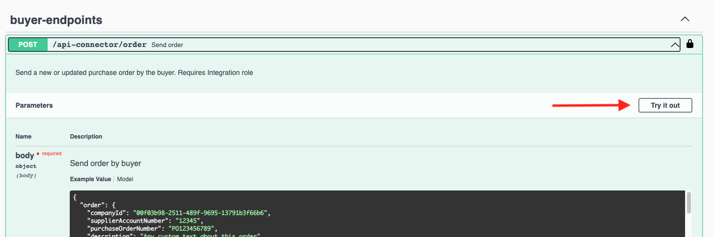
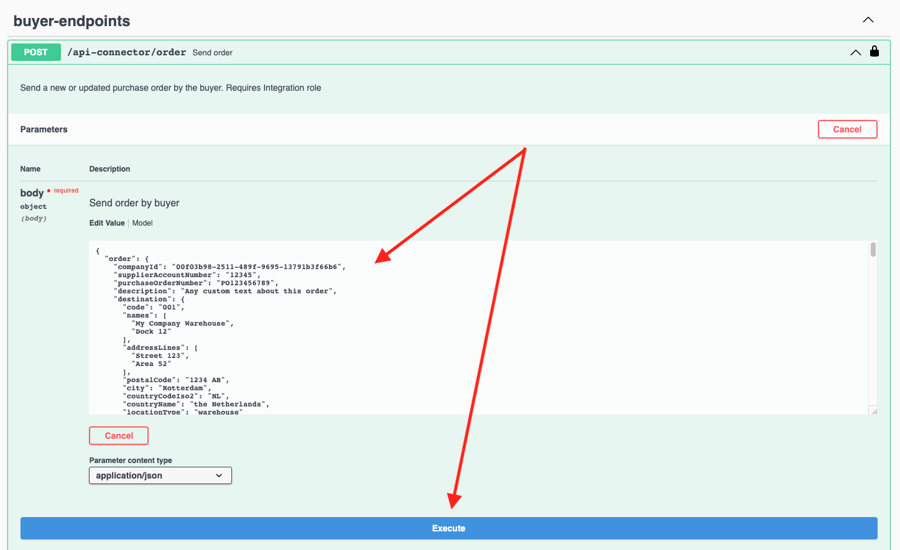

# Swagger UI

You can use the [Swagger UI](https://swagger.io/tools/swagger-ui/) to explore and test the Tradecloud API.

Please refer to the API Environments page for an overview of the available Swagger UI documentation.


[environments.md](../environments.md)


## Send an order using the Swagger UI

1.  Click the **Authorize** button on the top right

    
2.  Fill in your Basic authorization credentials of the integration user that was provided to you. Click **Authorize** and then **Close**.

    
3.  Click the endpoint you want to use and click on **Try it out**.

    
4.  Adjust the request body according to the data you want to send to Tradecloud.

    
5.  Click the **Execute** button.

    The **Responses** section in the Swagger UI should display the API response and the effects of your request should now be visible in the Tradecloud Portal.
