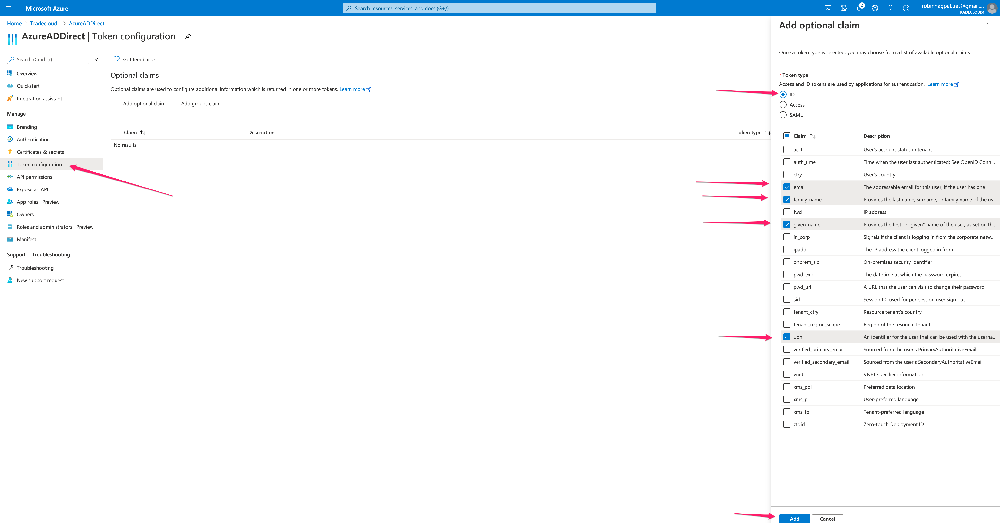
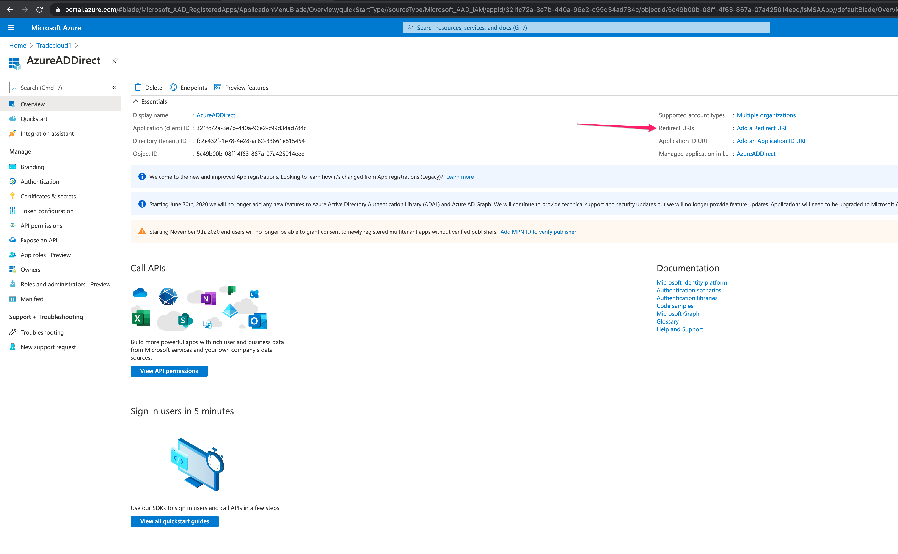
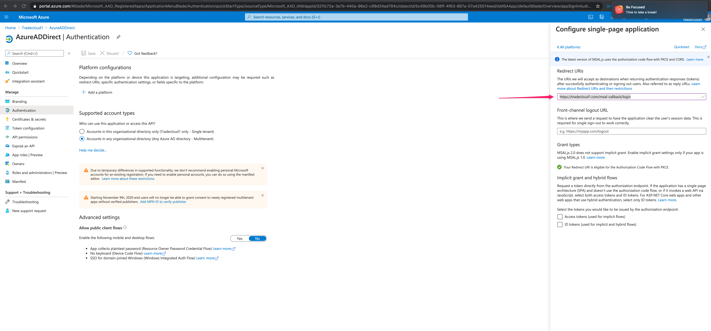
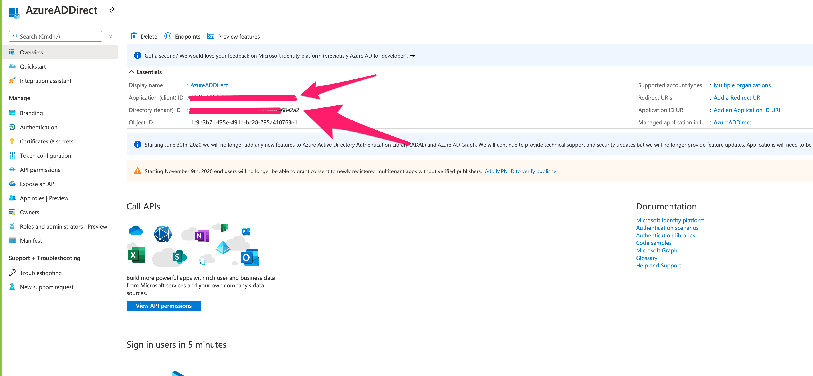

# Azure AD Connector - AD Configuration

The Azure AD Connector provides Single Sign On access for your users on Tradecloud.

Only the users you allow (using an AD conditional access policy) are synced to Tradecloud.

A new Active Directory user is automatically created in your Tradecloud company.


The Azure AD Connector is an add-on. Contact [sales@tradecloud1.com](sales@tradecloud1.com) for info.


## Configure Azure AD for authentication

To allow users to log in using a Azure AD account, you must register Tradecloud as an application in the Microsoft Azure portal.

To register your app with Azure AD, see Microsoft's [Quickstart: Register an application with the Microsoft identity platform](https://learn.microsoft.com/azure/active-directory/develop/quickstart-register-app).

During registration, configure the following settings:

| Option                  | Setting                                                                                                                                                                                                                                             |
| :---------------------- | :-------------------------------------------------------------------------------------------------------------------------------------------------------------------------------------------------------------------------------------------------- |
| Supported account types | To allow users from external organizations (like other Azure AD directories) choose the appropriate multitenant option. Multitenant options include the following: Accounts in any organizational directory (Any Azure AD directory - Multitenant). |
| Redirect URI            | Select "Single-page application (SPA)"                                                                                                                                                                                                              |
| Redirect URI            | Enter your callback URLs: [https://portal.tradecloud1.com/msal-callback/login](https://portal.tradecloud1.com/msal-callback/login)                                                                                                                  |

After registration, optionally add a second URI for the acceptance test environment:

| Option       | Setting                                                                                                            |
| :----------- | :----------------------------------------------------------------------------------------------------------------- |
| Redirect URI | [https://portal.accp.tradecloud1.com/msal-callback/login](https://portal.accp.tradecloud1.com/msal-callback/login) |

During the registration process, Microsoft generates an Application (client) ID; you can find this on the app's Overview screen. Take note of this value.

### Token configuration

Optional claims are used to configure additional information which is returned in the id_token.

Tradecloud needs `email`, `family_name`, `given_name`, and `upn` claims to be able to create a Tradecloud identity and user. These fields will be added to the id_token, which Tradecloud uses to create a Tradecloud identity and user.

While setting up your token configuration, add the following claims:

| Claim       | Description                                                                                                                                            | Token type |
| :---------- | :----------------------------------------------------------------------------------------------------------------------------------------------------- | :--------- |
| email       | The addressable email for this user, if the user has one                                                                                               | ID         |
| family_name | Provides the last name, surname, or family name of the user as defined in the user object                                                              | ID         |
| given_name  | Provides the first or "given" name of the user, as set on the user object                                                                              | ID         |
| upn         | An identifier for the user that can be used with the username_hint parameter; not a durable identifier for the user and should not be used to key data | ID         |

### Add permissions

To add the `email`, `family_name`, `given_name`, and `upn` claims to the id_token, Azure AD requires OpenID delegated `email` and `profile` permissions. These fields will be added to the id_token, which Tradecloud uses to create an identity and user. Tradecloud will NOT call the Graph API.

To add permissions, see Microsoft's [Quickstart: Configure a client application to access web APIs - Add permissions to access web APIs](https://docs.microsoft.com/en-us/azure/active-directory/develop/quickstart-configure-app-access-web-apis#add-permissions-to-access-web-apis).

You will need to configure OpenID permissions for the **Microsoft Graph API**.

While setting up your permissions, configure the following settings:

| Permission Section    | Permission        | Description                                             |
| :-------------------- | :---------------- | :------------------------------------------------------ |
| Delegated permissions | email profile     | View users' email address, View users' basic profile    |

### Set Redirect URI

Select the option to set Redirect URI:

Select the platform as Single page application:

Set the Redirect URI value to [https://portal.tradecloud1.com/msal-callback/login](https://portal.tradecloud1.com/msal-callback/login) and save:

### Send credentials to Tradecloud

Send client ID and tenant ID to Tradecloud so that one of the engineers can configure SSO for you.

