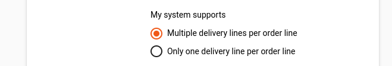
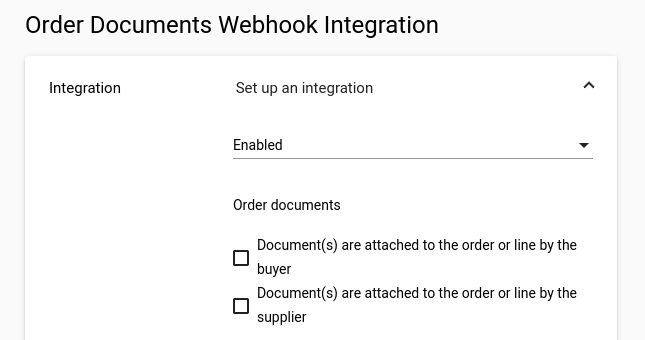
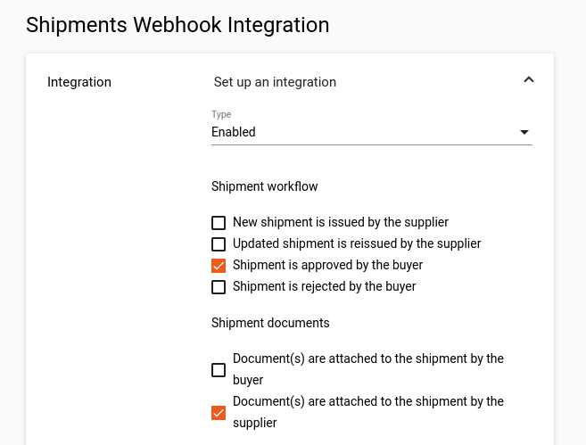
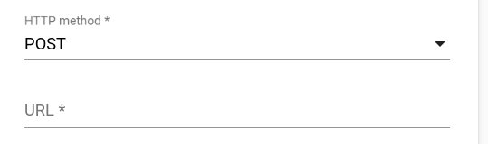
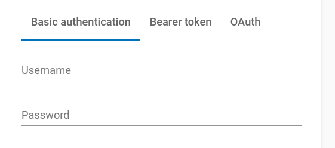
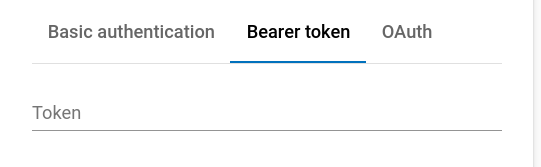
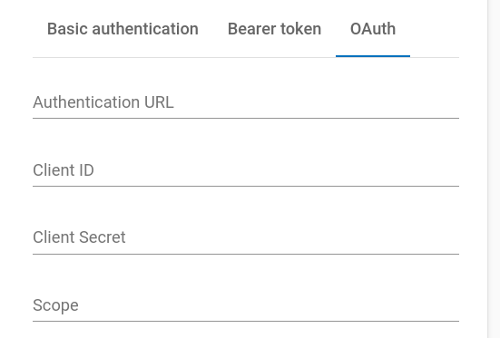

# Portal Configuration

Configure your webhook integrations in the Tradecloud portal to enable real-time event delivery to your systems.

## Accessing Webhook Settings

1. **Log in** to the [Tradecloud portal](https://portal.tradecloud1.com)
2. **Navigate** to **My Company** (under your avatar menu)  
3. **Select** the **Settings** tab
4. **Locate** the **Webhook Integration** section


**Admin Access Required**: Only company administrators can configure webhook settings.


## Order Events Configuration

Enable order webhook integration to receive notifications when orders are created, updated, or changed.

### Event Selection

Configure which order events trigger webhook notifications:

**Customization**: Select events based on your integration capabilities and business process requirements. See [complete event list](order-events.md) for all available options.

### Delivery Schedule Mode

Choose how order deliveries are structured in webhook payloads:

| Mode | Payload Field | Use Case |
|------|---------------|----------|
| **Multiple Deliveries** | `orderEvent` | Complex delivery schedules with multiple dates per line |
| **Single Delivery** | `singleDeliveryOrderEvent` | Simple orders with one delivery per order line |

**Learn More**: [Delivery Schedule vs Single Delivery](https://docs.tradecloud1.com/api/introduction/api/delivery-schedule) documentation.

## Document Events Configuration

Enable document webhook integration to receive notifications when order documents are attached or updated.

**Event Sources:**

- **Buyer Documents** - Documents added by order buyers
- **Supplier Documents** - Documents added by order suppliers  
- **Both** - All document events regardless of source

See [document events reference](order-documents-events.md) for complete event details.

## Shipment Events Configuration

Enable shipment webhook integration to receive notifications about despatch advice and delivery updates.

Customize event selection based on your logistics processes. See [shipment events reference](shipment-events.md) for all available events.

## Endpoint Configuration

Configure your webhook endpoint URL and HTTP method:

### Requirements

- **Method**: POST (only supported HTTP method)
- **URL**: Must start with `https://` (HTTP not supported)
- **Accessibility**: Endpoint must be publicly accessible from internet

**Example**: `https://api.yourcompany.com/webhooks/tradecloud`

## Authentication Setup

Configure secure authentication for webhook requests. Choose from three supported methods:

### Basic Authentication

**Configuration:**

- **Standard**: [RFC 7617](https://datatracker.ietf.org/doc/html/rfc7617) compliant
- **Username**: Webhook service username
- **Password**: Webhook service password  
- **Header**: `Authorization: Basic <base64(username:password)>`

### Bearer Token

**Configuration:**

- **Standard**: [RFC 6750](https://datatracker.ietf.org/doc/html/rfc6750) compliant
- **Token**: Static authentication token
- **Header**: `Authorization: Bearer <token>`

### OAuth 2.0 Client Credentials

**Configuration Fields:**

- **Authentication URL**: OAuth token endpoint  
  Example: `https://login.microsoftonline.com/<tenant-id>/oauth2/v2.0/token`
- **Client ID**: Application (client) ID from your OAuth provider
- **Client Secret**: Client secret value from your OAuth provider  
- **Scope**: Granted scope for webhook access
  Example: `https://your-webhook-endpoint/.default`

**Standard**: [RFC 6749 Section 4.4](https://datatracker.ietf.org/doc/html/rfc6749#section-4.4) compliant.

## Testing Configuration

### Development Testing

Use [webhook.site](https://webhook.site) for initial configuration testing:

1. **Generate test URL** at webhook.site
2. **Configure test webhook** with the generated URL  
3. **Use placeholder credentials** (webhook.site doesn't validate auth)
4. **Trigger test events** to validate payload delivery
5. **Inspect payloads** in webhook.site interface

### Integration Testing  

1. **Configure test endpoint** in Tradecloud acceptance environment portal
2. **Trigger test events** through sample transactions  
3. **Validate event processing** and response handling
4. **Test error scenarios** with various HTTP status codes

### Production Validation

1. **Configure production endpoint** in Tradecloud production environment portal
2. **Perform test transactions** to trigger events
3. **Validate event processing** in your system
4. **Monitor webhook logs** for delivery confirmation
