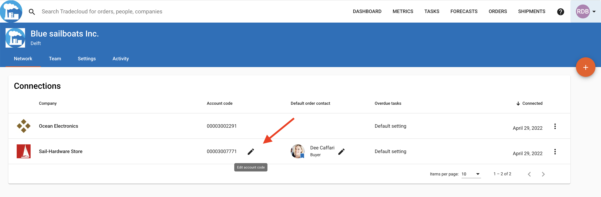

# Sending my first order with a Single Delivery in XML

This page explains how to send your first, very minimal order to Tradecloud using the API.

**This page assumes that you have all the prerequisites set up, as explained on the [Getting Started](../getting-started.md) page.**


Note that this guide helps you to send a first order with only the bare minimal information. This can be used as a Proof-of-Concept for a new integration with Tradecloud.
This minimal example will need to be extended with additional information, based on the functional requirements of the integration.

For more information about the full buyer order process and additional properties that can be sent in, please refer to the following page.




### Configure the supplier account number

If Tradecloud Support hasn't done so already, make sure that a supplier account number is configured in the Tradecloud portal for the (test) supplier you want to send your first order to.

1. Log into the [Web Portal](https://portal.accp.tradecloud1.com), and click on "My Network" in the menu.
2. Click on the pencil in the "Account Code" column, on the row of a test supplier.
3. Enter the supplier account number that matches the test supplier in your ERP and save.



### My first order with a Delivery Schedule

If you integration can support [Delivery Schedules](../../api/delivery-schedule.md#delivery-schedule) by default, follow these instructions.  
Else, skip to [Sending my first order with a Single Delivery](#my-first-order-with-a-single-delivery)

1. Set the URL to `https://api.accp.tradecloud1.com/v2/api-connector/order`
2. Set the HTTP Method to `POST`
3. Provide a **Basic Authentication** header, which contains the [username and password](../getting-started.md#2-getting-an-integration-account) of the integration account.
4. Provide the JSON below as the request body. Make sure you replace `{{supplierAccountNumber}}` with the supplier account number you have [configured](#configure-the-supplier-account-number) for a test supplier.

```xml
<?xml version="1.0" encoding="UTF-8"?>
<SendOrderByBuyer>
    <order>
        <supplierAccountNumber>{{supplierAccountNumber}}</supplierAccountNumber>
        <purchaseOrderNumber>PO123456789</purchaseOrderNumber>
        <destination>
            <name>My Company Warehouse</name>
            <name>Dock 12</name>
            <countryCodeIso2>NL</countryCodeIso2>
        </destination>
    </order>
    <line>
        <position>0001</position>
        <item>
            <name>Round tube 60x45</name>
            <purchaseUnitOfMeasureIso>PCE</purchaseUnitOfMeasureIso>
        </item>
        <scheduledDelivery>
            <date>2019-12-31</date>
            <quantity>1234.56</quantity>
        </scheduledDelivery>
        <prices>
            <netPrice>
                <priceInTransactionCurrency>
                    <value>1234.56</value>
                    <currencyIso>EUR</currencyIso>
                </priceInTransactionCurrency>
            </netPrice>
            <priceUnitOfMeasureIso>PCE</priceUnitOfMeasureIso>
            <priceUnitQuantity>100</priceUnitQuantity>
        </prices>
    </line>
</SendOrderByBuyer>
```

**That's all!**  
You can now log into the [Web Portal](https://portal.accp.tradecloud1.com) and go to the Order overview page. Your test order should be visible to you and the test supplier.

### What's next?
The following pages may be good to continue on when you wish to extend this minimal example:




