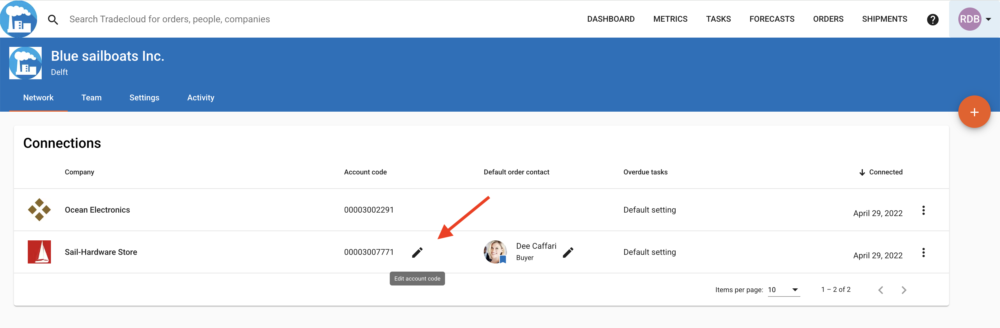

# 2. Setting up your Tradecloud Network

If Tradecloud Support hasn't done so already, make sure that a supplier account number is configured in the Tradecloud portal for the (test) supplier you want to send your first order to.

1. Log into the [Web Portal](https://portal.accp.tradecloud1.com), and click on "My Network" in the menu.
2. Click on the pencil in the "Account Code" column, on the row of a test supplier.
3. Enter the supplier account number that matches the test supplier in your ERP and save.

